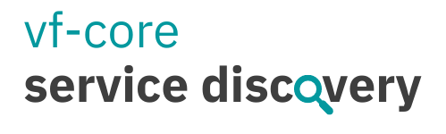

# 

[](https://github.com/oss6/vf-core-service-discovery/actions)
[](https://codecov.io/github/oss6/vf-core-service-discovery)
[](https://david-dm.org/oss6/vf-core-service-discovery)
[](https://www.npmjs.com/package/vf-core-service-discovery)
[](https://github.com/oss6/vf-core-service-discovery/blob/master/LICENSE)

> :warning: This project is currently in active development; use with caution. Thanks!

`vf-core-service-discovery` is a tool to analyse the usage of [vf-core](https://github.com/visual-framework/vf-core) in your project.

# Table of contents

<details>
<summary>Click to expand</summary>

- [Table of contents](#table-of-contents)
- [Install](#install)
- [Basic usage](#basic-usage)
  * [CLI](#basic-usage-cli)
  * [Module](#basic-usage-module)
- [Features](#features)
- [CLI documentation](#cli-documentation)
  * [`run`](#cli-documentation-run)
    - [Options](#cli-documentation-run-options)
  * [`config`](#cli-documentation-config)
    - [Configuration items](#cli-documentation-config-configuration-items)
    - [Options](#cli-documentation-config-options)
- [Module documentation](#module-documentation)
  * [Types](#module-documentation-types)
    - [`Options`](#module-documentation-types-options)
    - [`DiscoveryItem`](#module-documentation-types-discovery-item)
    - [`PDiscoveryItem`](#module-documentation-types-pdiscovery-item)
    - [`PipelineContext`](#module-documentation-types-pipeline-context)
    - [`GitHubDeviceLogin`](#module-documentation-types-github-device-login)
  * [`ServiceDiscovery`](#module-documentation-service-discovery)
    - [`setup`](#module-documentation-service-discovery-setup)
    - [`run`](#module-documentation-service-discovery-run)
  * [`pipeline.Pipeline`](#module-documentation-pipeline)
    - [`getInstance`](#module-documentation-pipeline-get-instance)
    - [`addStep`](#module-documentation-pipeline-add-step)
    - [`run`](#module-documentation-pipeline-run)
  * [Pipeline steps](#module-documentation-pipeline-steps)
    - [`getComponents`](#module-documentation-pipeline-steps-get-components)
    - [`getExactVersion`](#module-documentation-pipeline-steps-get-exact-version)
    - [`getPackageJson`](#module-documentation-pipeline-steps-get-package-json)
    - [`getConfig`](#module-documentation-pipeline-steps-get-config)
    - [`getChangelog`](#module-documentation-pipeline-steps-get-changelog)
    - [`getDependents`](#module-documentation-pipeline-steps-get-dependents)
- [What's next](#whats-next)
- [Contributing](#contributing)

</details>

# Install


Install the package using `npm` or `yarn` as follows:

```
$ npm i vf-core-service-discovery
```

```
$ yarn add vf-core-service-discovery
```

or globally

```
$ npm i -g vf-core-service-discovery
```

```
$ yarn global add vf-core-service-discovery
```

# Basic usage


## <a name="basic-usage-cli"></a>CLI


The main usage of `vf-core-service-discovery` is through a CLI.
A simple run of the following command will gather the usage of `vf-core` in the project:

```
$ vf-core-service-discovery run
```

An output example:


## <a name="basic-usage-module"></a>Module


`vf-core-service-discovery` can also be used as a module. A use case for this is if you want to have more control on the process.

```js
import runServiceDiscovery from 'vf-core-service-discovery';

async function run() {
  const discoveryOutput = await runServiceDiscovery({
    forceRun: false,
    forceGitHubAuth: false,
    verbose: true,
    logFile: 'vf-core-service-discovery.log',
    loggingEnabled: true,
  });

  console.log(discoveryOutput);
}

run();
```

# Features


- Get package information such as current version, latest version, and component status.
- Get changelog if current and latest versions are mismatched.
- For each installed component get the dependent files (for now only `.html` files).

# CLI documentation


| Synopsis             | Description               |
|----------------------|---------------------------|
| `run`                  | Run the service discovery |
| `config [key] [value]` | Manage the configuration  |

## <a name="cli-documentation-run"></a>`run`

Synopsis: `vf-core-service-discovery run [options]`

### <a name="cli-documentation-run-options"></a> Options

| Option                  | Type    | Default                         | Description                 |
|-------------------------|---------|---------------------------------|-----------------------------|
| `-v`, `--verbose`           | boolean | false                           | Show debug information      |
| `-l`, `--log-file`          | string  | 'vf-core-service-discovery.log' | Log file location           |
| `-f`, `--force`             | boolean | false                           | By-pass the cache           |
| `-g`, `--force-github-auth` | boolean | false                           | Force GitHub authentication |

## <a name="cli-documentation-config"></a>`config`

Synopsis: `vf-core-service-discovery config [key] [value] [options]`

### <a name="cli-documentation-config-configuration-items"></a>Configuration items

| Key                 | Value  | Default | Description                              |
|---------------------|--------|---------|------------------------------------------|
| `cacheExpiry`       | string | 8h      | Time before the cache expires            |
| `lastInvalidation`  | Date   | null    | Last time the cache has been invalidated |
| `gitHubAccessToken` | string | ''      | GitHub access token                      |
| `vfCoreVersion`     | string | ''      | Latest vf-core release version           |

### <a name="cli-documentation-config-options"></a>Options

| Option             | Type    | Default                         | Description                     |
|--------------------|---------|---------------------------------|---------------------------------|
| `-v`, `--verbose`  | boolean | false                           | Show debug information          |
| `-l`, `--log-file` | string  | 'vf-core-service-discovery.log' | Log file location               |
| `-r`, `--reset`    | boolean | false                           | Reset configuration to defaults |

# Module documentation

## <a name="module-documentation-types"></a>Types

Throughout the documentation you'll come across these types which define the inputs and outputs of the API.

### <a name="module-documentation-types-options"></a>`Options`

The options to the service discovery runner.

```ts
interface Options {
  forceRun: boolean;
  forceGitHubAuth: boolean;
  verbose: boolean;
  loggingEnabled: boolean;
  logFile: string;
}
```

### <a name="module-documentation-types-discovery-item"></a>`DiscoveryItem`

Defines a discovery item, which is a component under analysis (e.g. `vf-box`).

```ts
interface DiscoveryItem {
  name: string;                 // Component name (e.g. @visual-framework/vf-box)
  nameWithoutPrefix: string;    // e.g. vf-box
  version: string;              // Installed version of the component
  packageJson: PackageJson;     // Latest version package.json
  config: ComponentConfig;      // Latest version config
  changelog: ChangelogItem[];   // Changelog between the installed and latest version
  dependents: string[];         // Files that use the component
}
```

### <a name="module-documentation-types-pdiscovery-item"></a>`PDiscoveryItem`

An alias for `Partial<DiscoveryItem>`

`PipelineStep`

A pipeline step is a function that takes a source discovery item and a processing/pipeline context and returns the processed/extended discovery item.

```ts
export type PipelineStep = (source: PDiscoveryItem, context: PipelineContext) => Promise<PDiscoveryItem>;
```

### <a name="module-documentation-types-pipeline-context"></a>`PipelineContext`

Defines a context that is global to the pipeline.

```ts
interface PipelineContext {
  rootDirectory: string;    // Root directory to analyse
  vfPackagePrefix: string;  // '@visual-framework'
}
```

### <a name="module-documentation-types-github-device-login"></a>`GitHubDeviceLogin`

Defines the response from `POST https://github.com/login/device/code`.

```ts
export interface GitHubDeviceLogin {
  userCode: string;
  verificationUri: string;
  interval: number;
  deviceCode: string;
  expiresIn: number;
}
```

## <a name="module-documentation-service-discovery"></a>`ServiceDiscovery`

Class that defines a service discovery session/run.

### <a name="module-documentation-service-discovery-get-instance"></a>`ServiceDiscovery.getInstance`

Static method that gets the `ServiceDiscovery` singleton.

#### Returns

`ServiceDiscovery`

### <a name="module-documentation-service-discovery-setup"></a>`setup`

Sets up the service discovery runner.

It returns an `AsyncGenerator` because in the case of GitHub authentication the first `next()` returns the `GitHubDeviceLogin`,
then the setup resumes.

- Sets the options
- Prepares the configuration
- Check whether to invalidate

#### Parameters

- `options: Options`

#### Returns

`AsyncGenerator<GitHubDeviceLogin, void, unknown>`

#### Example

```ts
import ServiceDiscovery from 'vf-core-service-discovery';

(async () => {
  const serviceDiscovery = ServiceDiscovery.getInstance();

  const setupGenerator = serviceDiscovery.setup({
    forceRun: false,
    forceGitHubAuth: true,
    verbose: true,
    logFile: 'vf-core-service-discovery.log',
    loggingEnabled: true,
  });

  let setupResult = await setupGenerator.next();

  if (!setupResult.done) {
    const { expiresIn, userCode, verificationUri } = setupResult.value as GitHubDeviceLogin;
    const expiry = Math.floor(expiresIn / 60);

    console.log(`Please enter the code ${userCode} at ${verificationUri}. This expires in ${expiry} minutes.`);

    await sleep(2000);
    await open(verificationUri);

    setupResult = await setupGenerator.next();
  }
})();
```

### <a name="module-documentation-service-discovery-run"></a>`run`

Runs the service discovery.

#### Parameters

- `reportProgress: boolean`
  * Whether to report the progress of the analysis in the CLI.
  * default: `false`

#### Returns

`Promise<PDiscoveryItem[]>`

#### Example

```ts
import ServiceDiscovery from 'vf-core-service-discovery';

(async () => {
  const serviceDiscovery = ServiceDiscovery.getInstance();

  // complete setup (see above)...

  const discoveryItems = await serviceDiscovery.run();

  console.log(discoveryItems);
})();
```

## <a name="module-documentation-pipeline"></a>`pipeline.Pipeline`


Class that defines a pipeline which processes discovery items.

### <a name="module-documentation-pipeline-get-instance"></a>`Pipeline.getInstance`


Static method that gets the `Pipeline` singleton.

#### Returns

`Pipeline`

### <a name="module-documentation-pipeline-add-step"></a>`addStep`


Adds a step to the pipeline.

#### Parameters

- `step: PipelineStep`

#### Returns

`Pipeline` - for chaining

#### Example

```ts
import { pipeline } from 'vf-core-service-discovery';

const vfPipeline = pipeline.getInstance();

vfPipeline
  .addStep(step1)
  .addStep(step2)
  .addStep(step3);
```

### <a name="module-documentation-pipeline-run"></a>`run`


Runs the pipeline given a source and a context.

#### Parameters

- `source: string[]`
- `context: PipelineContext`
- `reportProgress: boolean`

#### Returns

`Promise<PDiscoveryItem[]>`

#### Example

```ts
import { pipeline } from 'vf-core-service-discovery';

const vfPipeline = pipeline.getInstance();
const source = ['vf-box', 'vf-footer'];
const context: PipelineContext = {
  rootDirectory: '/test',
  vfPackagePrefix: '@visual-framework',
};

(async () => {
  const discoveryItems = vfPipeline
    .addStep(step1)
    .addStep(step2)
    .addStep(step3)
    .run(source, context);

  console.log(discoveryItems);
})();
```

## <a name="module-documentation-pipeline-steps"></a>Pipeline steps


Each pipeline step extends from the previous step.
Each component item (discovery item) goes through these steps.

### <a name="module-documentation-pipeline-steps-get-components"></a>`getComponents`


Gets the installed components in the current project.

#### Parameters

- `context: PipelineContext`

#### Returns

- `Promise<string[]>`

#### Example

```ts
import { pipeline } from 'vf-core-service-discovery';

(async () => {
  const components = await pipeline.getComponents({
    rootDirectory: process.cwd()',
    vfPackagePrefix: '@visual-framework',
  });

  console.log(components);
})();
```

### <a name="module-documentation-pipeline-steps-get-exact-version"></a>`getExactVersion`


Extends the discovery item with the exact version of the installed component from the local lock file.

#### Parameters

- `discoveryItem: PDiscoveryItem`
- `context: PipelineContext`

#### Returns

`Promise<PDiscoveryItem>`

#### Example

```ts
import { pipeline } from 'vf-core-service-discovery';

(async () => {
  const discoveryItem = await pipeline.getExactVersion({
    name: '@visual-framework/vf-box',
    nameWithoutPrefix: 'vf-box',
  });

  console.log(discoveryItem.version);
})();
```

### <a name="module-documentation-pipeline-steps-get-package-json"></a>`getPackageJson`


Extends the discovery item with the latest package.json of the installed component.

#### Parameters

- `discoveryItem: PDiscoveryItem`

#### Returns

`Promise<PDiscoveryItem>`

#### Example

```ts
import { pipeline } from 'vf-core-service-discovery';

(async () => {
  const discoveryItem = await pipeline.getPackageJson({
    name: '@visual-framework/vf-box',
    nameWithoutPrefix: 'vf-box',
    version: '1.2.3',
  });

  console.log(discoveryItem.packageJson);
})();
```

### <a name="module-documentation-pipeline-steps-get-config"></a>`getConfig`


Extends the discovery item with the latest component configuration file (YAML or JS).

#### Parameters

- `discoveryItem: PDiscoveryItem`

#### Returns

`Promise<PDiscoveryItem>`

#### Example

```ts
import { pipeline } from 'vf-core-service-discovery';

(async () => {
  const discoveryItem = await pipeline.getConfig({
    name: '@visual-framework/vf-box',
    nameWithoutPrefix: 'vf-box',
    version: '1.2.3',
    packageJson: {
      version: '1.3.0',
    }
  });

  console.log(discoveryItem.config);
})();
```

### <a name="module-documentation-pipeline-steps-get-changelog"></a>`getChangelog`


Extends the discovery item with the changelog between the installed and the latest version.

#### Parameters

- `discoveryItem: PDiscoveryItem`

#### Returns

`Promise<PDiscoveryItem>`

#### Example

```ts
import { pipeline } from 'vf-core-service-discovery';

(async () => {
  const discoveryItem = await pipeline.getChangelog({
    name: '@visual-framework/vf-box',
    nameWithoutPrefix: 'vf-box',
    version: '1.2.3',
    packageJson: {
      version: '1.3.0',
    },
    config: {
      title: 'Box',
      label: 'vf-box',
      status: 'live',
    }
  });

  console.log(discoveryItem.changelog);
})();
```

### <a name="module-documentation-pipeline-steps-get-dependents"></a>`getDependents`


Extends the discovery item with the dependents of the component.

#### Parameters

- `discoveryItem: PDiscoveryItem`
- `context: PipelineContext`

#### Returns

`Promise<PDiscoveryItem>`

#### Example

```ts
import { pipeline } from 'vf-core-service-discovery';

(async () => {
  const discoveryItem = await pipeline.getDependents({
    name: '@visual-framework/vf-box',
    nameWithoutPrefix: 'vf-box',
    version: '1.2.3',
    packageJson: {
      version: '1.3.0',
    },
    config: {
      title: 'Box',
      label: 'vf-box',
      status: 'live',
    },
    changelog: []
  });

  console.log(discoveryItem.dependents);
})();
```

# What's next


1. Find dependents in different types of projects (for a start Angular and React).
2. API documentation.
3. Parallelise processing.
4. Better user experience and interface.

# Contributing


We welcome contributors and maintainers! To contribute please check the [contributing page](CONTRIBUTING.md) out.
