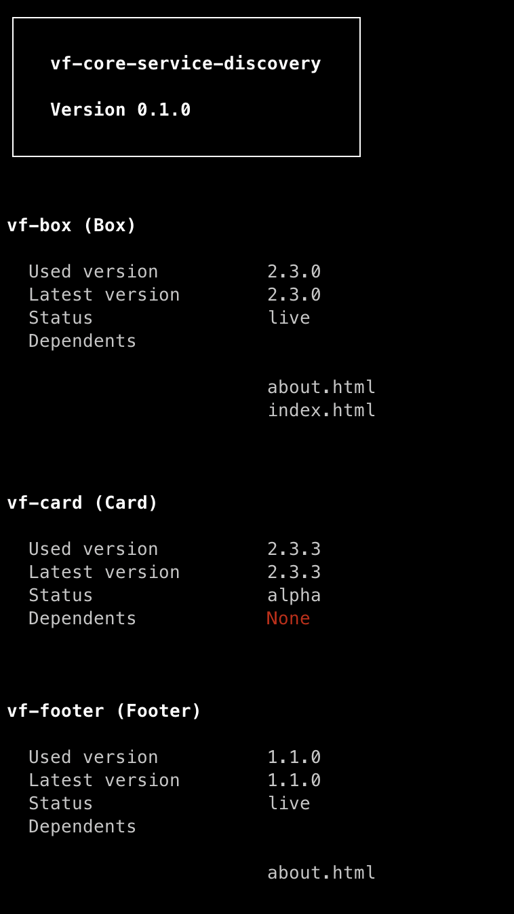

# vf-core-service-discovery


> :warning: This project is currently in active development; use with caution. Thanks!

`vf-core-service-discovery` is a tool to analyse the usage of [vf-core](https://github.com/visual-framework/vf-core) in your project.

## Install

Install the package using `npm` or `yarn` as follows:

```
$ npm i vf-core-service-discovery
```

```
$ yarn add vf-core-service-discovery
```

or globally

```
$ npm i -g vf-core-service-discovery
```

```
$ yarn global add vf-core-service-discovery
```

## Basic usage

A simple run of the following command will gather the usage of `vf-core` in the project:

```
$ vf-core-service-discovery
```

An output example:



## Features

- Get package information such as current version, latest version, and component status.
- Get changelog if current and latest versions are mismatched.
- For each installed component get the dependent files (for now only `.html` files).

## Contributing

We welcome contributors and maintainers! To contribute please check the [contributing page](CONTRIBUTING.md) out.
